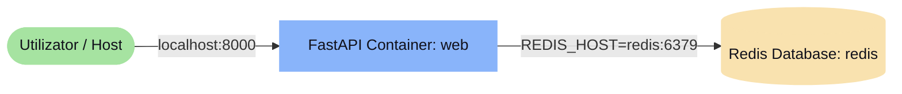
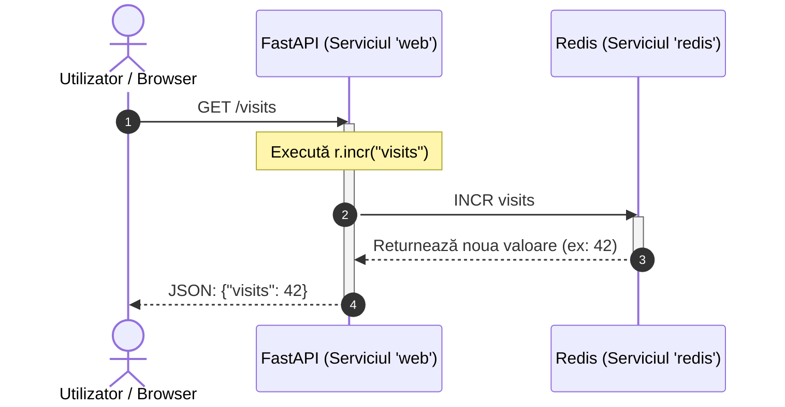
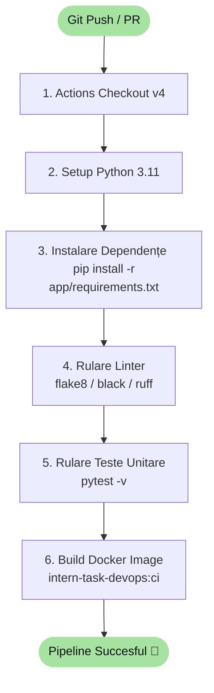

# 📐 Arhitectură & Diagrame Mermaid

Acest document descrie arhitectura sistemului FastAPI + Redis și fluxul pipeline-ului de CI/CD.

---

## 🖥️ Topologia Aplicației (Docker Compose)

Aplicația este formată din două containere care rulează pe aceeași rețea Docker implicită (bridge network):
1. **`web`**: FastAPI rulat pe portul `8000`. Expune portul `8000` către exterior.
2. **`redis`**: Instanță de Redis Cache care stochează vizitele în memorie.

---

## 🔁 Diagramă de Secvență (Request Flow)

Cum se procesează un request la endpoint-ul `/visits` (configurat în [app/main.py](../../app/main.py)):

Pentru endpoint-urile noi solicitate în [README.md](../../README.md):
- **`GET /visits/count`**: Citește valoarea folosind `r.get("visits")` fără să o incrementeze.
- **`POST /visits/reset`**: Resetează valoarea cu `r.set("visits", 0)`.

---

## 🏗️ Diagramă de Flux (CI/CD Pipeline)

Fluxul dorit pentru pipeline-ul din [.github/workflows/ci.yml](../../.github/workflows/ci.yml) la fiecare `git push`:

---

> [!NOTE]
> Pentru detalii despre problemele de networking identificate între containere, consultă [[03_Debugging/Bug_Journal.md|Jurnalul de Debugging]].
