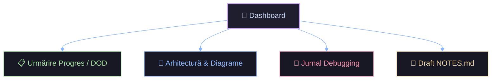

# 🚀 DevOps Internship Project Dashboard

> [!IMPORTANT]
> Bun venit la playbook-ul interactiv pentru assignment-ul DevOps de la **Riverbed**. Acest vault este organizat special pentru a urmări rezolvarea task-urilor, documentarea bug-urilor descoperite și pregătirea write-up-ului final.
>
> 💡 *Regulă de aur:* Citește logurile și folosește **GitNexus** pentru a analiza codul și impactul modificărilor înainte de a edita fișierele!

---

## 🗺️ Hartă Navigare Vault

### 📋 [Urmărire Progres & Definition of Done]([[02_Tasks/DOD_Tracker.md]])
Monitorizează cerințele obligatorii ale proiectului, stadiul lor și ce trebuie să verifici înainte de livrarea finală.

### 📐 [Arhitectură & Diagrame Mermaid]([[01_Architecture/Architecture_Overview.md]])
Vizualizează topologia serviciilor, cum circulă datele între FastAPI și Redis și structura pipeline-ului CI/CD din GitHub Actions.

### 🐛 [Jurnal de Debugging (Debugging Log)]([[03_Debugging/Bug_Journal.md]])
Vezi analiza problemelor identificate în `Dockerfile`, `docker-compose.yml` și `.github/workflows/ci.yml`. Fiecare bug are documentat: *Simptom*, *Investigație*, *Cauză* și *Soluție*.

### 📝 [Draft NOTES.md (Pregătire Livrare)]([[04_Notes_Prep/NOTES_Draft.md]])
Colectează deciziile de design, optimizările Docker și explicațiile de networking pe care le vei trece în fișierul final de predare.

---

## 🛠️ Comenzi Utile în Proiect

| Comandă | Scop | Locație de rulare |
|---|---|---|
| `docker compose up --build` | Construiește și pornește aplicația local | Root-ul proiectului |
| `docker compose ps` | Verifică starea serviciilor și healthcheck | Root-ul proiectului |
| `pytest -v` | Rulează testele unitare local | Root-ul proiectului |
| `npx gitnexus analyze` | Actualizează indexul de analiză statică | Root-ul proiectului |

---

> [!TIP]
> Poți deschide fișierul de vizualizare interactivă a componentelor direct în Obsidian: [[devops_topology.canvas|Deschide Topology Canvas]].
